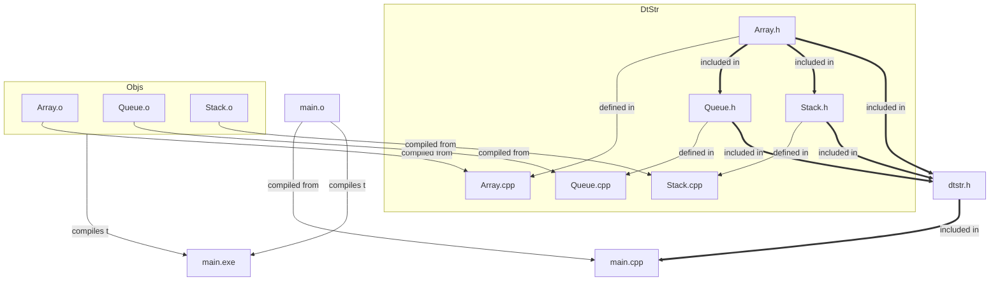

# DataStructures

Topics to Cover:

| DATE    | DURATION | TOPIC NAME          | SUB-TOPICS                                                                                           |
| ------- | -------- | ------------------ | ---------------------------------------------------------------------------------------------------- |
| Day 1   | 1        | Basic Concepts     | Time Complexity, Data Structures (Arrays, Linked Lists, Stacks, Queues), Linear Search, Binary Search |
| Day 2   | 1        | Sorting Algorithms | Bubble Sort, Insertion Sort, Selection Sort, Merge Sort, Quick Sort                                 |
| Day 3-6 | 4        | Recursion          | Recursive functions, Backtracking, Divide and conquer                                               |
| Day 7-11 | 5        | Trees              | Binary Trees, Binary Search Trees, AVL Trees, B Trees, Red-Black Trees, Trie Trees                  |
| Day 12-15 | 4       | Hashing            | Hash Table, Collision Resolution Techniques (Chaining, Open Addressing), Hash Functions            |
| Day 16-19 | 4       | String Algorithms  | Pattern matching algorithms (Naive, KMP, Rabin-Karp, Boyer-Moore)                                   |
| Day 20-24 | 5       | Dynamic Programming | Top-down approach, Bottom-up approach, Memoization, Knapsack Problem, Longest Common Subsequence, Edit Distance |
| Day 25-27 | 3       | Graphs             | Graph Representation, BFS, DFS, Shortest path algorithms (Dijkstra, Bellman-Ford, Floyd Warshall), MST (Prim's Algorithm, Kruskal's Algorithm) |
| Day 28-29 | 2       | Advanced Topics    | Bit Manipulation, Segment Trees, Fenwick Trees, Suffix Arrays, Suffix Trees                         |
| Day 30   | 1        | Practice Problems and Revision | Practice problems from each topic and revise concepts                                     |

