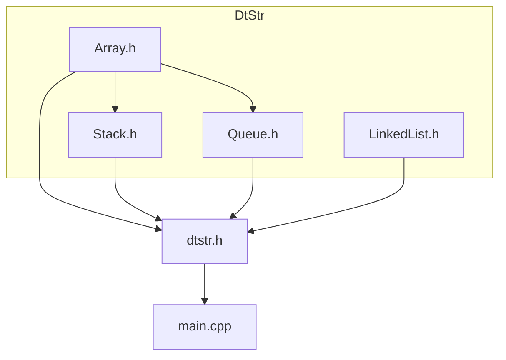
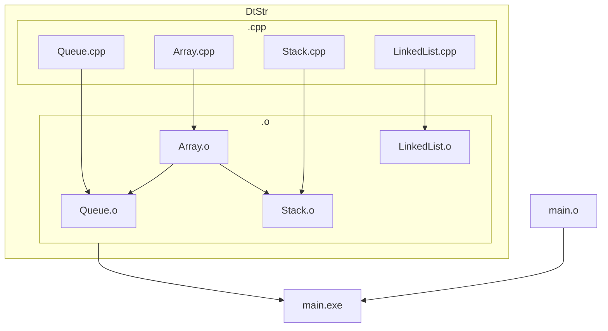

# DataStructures

This is a C/C++ library that contians Data Structure templates for all the important data types, their methods and algorithms. Everyone is free to fork and modfiy this repository. 

## How to use

### Pre-Reqizits

1. [Makefile](https://gnuwin32.sourceforge.net/packages/make.htm)
1. g++/MinGW 

### Steps to build

1. Fork and clone the repository in your machine.
2. Create a main.cpp file and include the library.
```
# include "dtstr.h"
```
3. Navigate to DataStructure folder and open terminal, to write the command below
```
make
```
4. To remove all object files and executables run:
```
make clean
```
**Make sure to clean all the .o and .exe files before rebuilding the project after editing.**

### Usage

Required DataStructure can be created in the following way:

*Here is an example to use 'Array' Data Structure.*

```
dtstr::Array<int> arr(6, 0);
```

**dtstr**: is the the namespace for accessing the objects and methods of the library. You can also use the namespace in the following mannner.
```
using namespace dtstr;
```
This may interfere with identifies you are using in the code as 'Array', 'Queue', 'Stack' are name for tempalte class of respective Data Structure.

**Array**: Array is a template class for Array data structure. Here the array is of 'int' type. (Elements of array are of type 'int'). Data structures with the desired type can be made by name of data type after class name. Similarly Array for 'bool', 'char', 'double' etc. can be created;

**arr**: Is the name of object that is created with the default constructor. Many data structures in this library also support construcor overloading.

**The type of parameters and return type of some functions will vary according to the template create by the user.**

## File Structure

-----------------------------
| Name | Type | Description |
|------|------|-------------|
Dtstr  | Directory | Contains code for Data Structures, template classes are declared in *.h files while their definations are persent in respective .cpp files.
Objs   | Directory | After building object files for each .cpp file in ../DtStr is created here.
dtstr.h| Header    | Is the main header file which includes all the header files in ./DtStr folder. Instead of including all the .h files in DtStr user can directly include dtstr.h and access any data structure.
Makefile | Makefile | Is the makefile for the repository and contains the recipie for building the executable.
main.cpp | C++ | Contains the driver code.

### Include Diagram



### Build Diagram


